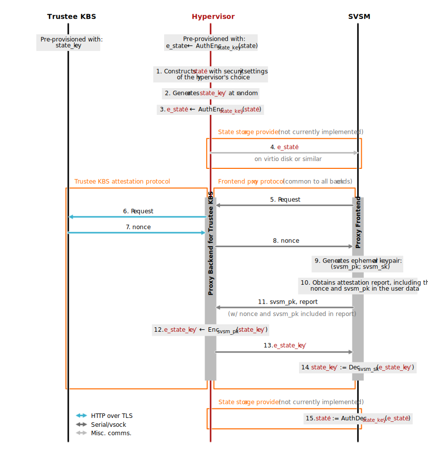

# Security Analysis of the   Host-Based Attestation Proxy in Coconut SVSM

Permalink to latest version: https://stringlytyped.github.io/publications/csvsm-proxy-security-analysis/

**Author:** Jean Snyman, Hewlett Packard Labs (Security)

#### Change History

- 2025-01-09: (Current) Initial version

 

<table>
<thead><tr>
    <th>Contents</th>
</tr></thead>
<tbody><tr><td>

- [Introduction](#introduction)
- [Preliminaries](#preliminaries)
  - [System Architecture](#system-architecture)
  - [Primitives](#primitives)
  - [Execution Environment](#execution-environment)
  - [End-to-End Protocol](#end-to-end-protocol)
  - [Attacker Capabilities](#attacker-capabilities)
- [Attack Scenarios](#attack-scenarios)
  - [UEFI Variable Persistence](#uefi-variable-persistence)
    - [Scenario A: Variable Rollback](#scenario-a-variable-rollback)
    - [Scenario B: Variable Injection](#scenario-b-variable-injection)
  - [TPM Attestation](#tpm-attestation)
  - [General Secrets Storage](#general-secrets-storage)
  - [Multiple Key Brokers](#multiple-key-brokers)
- [Security for Full-Disk Encryption (FDE)](#security-for-full-disk-encryption-fde)
  - [Inappropriate Uses for TPM-Sealed FDE](#inappropriate-uses-for-tpm-sealed-fde)
    - [Disk Authentication](#disk-authentication)
    - [Runtime Integrity](#runtime-integrity)
    - [Composition With Other TPM Uses](#composition-with-other-tpm-uses)
  - [Analysis Limitations](#analysis-limitations)
    - [State Key Provisioning](#state-key-provisioning)
    - [Confidence](#confidence)
- [Acknowledgements](#acknowledgements)

</td></tr></tbody></table>

 

## Introduction

The Coconut-SVSM community is pursuing a plan[^proxy-prop][^proxy-pr] to allow the SVSM to attest the state of the TEE to an external verifier directly, rather than simply serving attestation reports to other software co-resident within the CVM. This is to later enable persistence of state across CVM reboots, mainly for long-lived TPM keys and (in the longer term) UEFI variables. Because Coconut-SVSM does not have a network stack, the idea is to proxy messages through the hypervisor.

While flaws have previously been pointed out by members of the Keylime attestation project,[^kl-prop] we (the authors) feel there remain aspects which require further discussion. The limitations of the approach should be transparently understood by the community and users of Coconut-SVSM, or it may be deployed in scenarios which compromise the security of the TEE. This document summarises, to the best of our knowledge, the security characteristics of the proxy as implemented today and shows how we arrive at our conclusions.

We will demonstrate that the host-based proxy is likely **not secure**[^secure-def] for the following uses:

- Persistence of UEFI variables
- Persistence of TPM state when the TPM is used for attestation
- Confidential storage of secrets in the TPM for applications other than full-disk encryption (FDE)
- Protection of data in environments with multiple key brokers

The host-based proxy **may be secure**[^secure-def] for the following uses:

- Full-disk encryption (FDE) with keys appropriately sealed against TPM PCRs

This is contingent on a number of factors which we will enumerate.

## Preliminaries

### System Architecture

The host-based proxy is implemented with two parts: a frontend which connects the SVSM to the hypervisor and a backend which the hypervisor uses to contact an external key broker. This architecture allows multiple different attestation protocols and key brokers to be supported through the implementation of additional backends. The backend currently implemented is for the Trustee Key Broker Service (KBS).

A future patch to Coconut-SVSM is intended to read/write state data (encrypted with a key obtained from the KBS) to a storage location provided by the hypervisor. Although the full details of this mechanism are not yet known, for the purposes of our security analysis we assume the state data will be encrypted using an authenticated encryption scheme.

### Primitives

We will say that this authenticated encryption scheme consists of encryption algorithm $\mathsf{AuthEnc}$ and decryption algorithm $\mathsf{AuthDec}$. The scheme is assumed to be secure w.r.t. IND-CCA2[^ind-cca2] and EUF-CMA[^euf-cma].

For notational purposes, we use algorithms $\mathsf{Enc}$ and $\mathsf{Dec}$ to perform both asymmetric and symmetric encryption/decryption. We assume the underlying schemes are IND-CCA2[^ind-cca2] secure.

### Execution Environment

A CVM's SVSM is assumed to run at VMPL0 with the system firmware, bootloader and OS running at VMPL1 or greater. The SVSM and UEFI binaries are assumed to be included in the launch measurement of the TEE, while the bootloader and OS are not.

Because Coconut-SVSM currently only supports SEV-SNP, we use AMD terminology throughout. We assume that a future version of Coconut-SVSM with Intel TDX support would work in a similar fashion. For modelling, we approximate the CVM launch process in TDX to be equivalent to the launch process in SEV-SNP with no signed ID block provided.

### End-to-End Protocol

It is understood that the security of a construction does not necessarily hold under composition [^prot-comp-1] [^prot-comp-2]. We therefore give the entire end-to-end protocol implemented by the host-based proxy and future storage provider in the following diagram:

  
   
  <em><strong>Figure 1:</strong> Trustee KBS protocol proxied through hypervisor</em>

Interactions between the SVSM and the processor and between the SVSM and components running at higher VMPLs are not shown but still assumed to take place.

### Attacker Capabilities

The adversary we consider in our analysis is modelled after the hypervisor (the host) which is responsible for running the CVMs. This is because the hypervisor is simultaneously the strongest possible adversary in a CSP environment and also the entity which AMD SEV-SNP and Intel TDX are intended to defend against.

Our idealised attacker has much in common with a traditional network-based (Dolev-Yao) attacker with full control over network communications. However, it may additionally exercise limited control over the CVMs themselves (as the hypervisor is responsible for providing the memory pages used to launch a CVM and its virtualised hardware resources).

Additionally, to properly analyse the effects on TPM attestation,[^attestation-security] we model the vTPM as a separate communication party and extend the "network" to include the channel between a CVM's vTPM and the rest of the CVM.

Finally, the key broker is treated as fully trusted, so we assume the attacker cannot corrupt (i.e., control or impersonate) the key broker. How integrity of the key broker is achieved in practice is beyond the scope of this analysis.

## Attack Scenarios

### UEFI Variable Persistence

Because UEFI variables control the firmware's security features, authenticity and timeliness need to be ensured when persisting these using potentially malicious hypervisor-provided storage. As the described protocol does not achieve either, the host-based proxy is not appropriate for this use.

We given two examples of possible attacks in the subsections below:

#### Scenario A: Variable Rollback

Consider a CVM with UEFI Secure Boot enabled. The firmware's list of trusted keys contains an OS vendor key used to sign the bootloader. UEFI variables are encrypted with an authenticated encryption scheme (as [described](#system-architecture)) and stored in hypervisor-provided storage.

Now imagine the following events occur in order:

- **Step 1:** The hypervisor copies the CVM's current persisted UEFI variable state ($\mathrm{e \textunderscore state}_1$) and boot disk containing the bootloader ($\mathrm{disk}_1$).
- **Step 2:** A patch is released to fix a critical vulnerability discovered in the bootloader. The user updates the CVM's bootloader to the latest version, resulting in $\mathrm{disk}_2$.
- **Step 3:** The user revokes trust in the old version of the bootloader by adding its signature to the UEFI revocation list. The updated UEFI variable state is encrypted and written to hypervisor storage as $\mathrm{e \textunderscore state}_2$.
- **Step 4:** The hypervisor reboots the CVM and attaches $\mathrm{disk}_1$ and $\mathrm{e \textunderscore state}_1$ causing the CVM to start with the revoked bootloader.
- **Step 5:** The hypervisor exploits the vulnerability, e.g., to install a bootkit in the CVM. 

As the bootloader is stored unencrypted on disk (even when FDE is enabled), the hypervisor may also modify $\mathrm{disk}_2$ to overwrite the updated bootloader with the old version from $\mathrm{disk}_1$. The resulting $\mathrm{disk}_2'$ could then be attached in step 4 instead.

Normally this would be detectable by TPM-based remote attestation after boot. However, as we show later on, the hypervisor can [circumvent TPM attestation](#tpm-attestation).

#### Scenario B: Variable Injection

Consider a CVM with UEFI Secure Boot enabled. UEFI variables are encrypted with an authenticated encryption scheme (as [described](#system-architecture)) and the result ($\mathrm{e \textunderscore state}$) is stored in hypervisor-provided storage.

Imagine the following events, also shown in Figure 2 below, occur in order:

- **Step 1:** Knowing how UEFI variables are serialised by the SVSM, the hypervisor constructs its own UEFI variable state ($\mathrm{state}'$) in the correct format.
- **Step 2:** The hypervisor chooses at random its own state encryption key ($\mathrm{state \textunderscore key}'$).
- **Step 3:** The hypervisor produces $\mathrm{e \textunderscore state}' \leftarrow \mathsf{AuthEnc}_{\mathrm{state \textunderscore key}'}(\mathrm{state}')$.
- **Step 4:** The hypervisor starts the CVM and attaches a virtual disk containing $\mathrm{e \textunderscore state}'$.
- **Step 5–10:** The SVSM inside the CVM proceeds with attestation and generates an ephemeral keypair ($\mathrm{svsm \textunderscore pk}$, $\mathrm{svsm \textunderscore sk}$).
- **Step 11:** In its participation in the attestation protocol, the hypervisor receives $\mathrm{svsm \textunderscore pk}$ in plain text.
- **Step 12–13:** When the SVSM should receive $\mathrm{e \textunderscore state \textunderscore key} ← \mathsf{Enc}_{\mathrm{svsm \textunderscore pk}}(\mathrm{state \textunderscore key})$ as provided by the KBS (the legitimate state encryption key encrypted with the SVSM's ephemeral public key), the hypervisor instead provides $\mathrm{e \textunderscore state \textunderscore key'} ← \mathsf{Enc}_{\mathrm{svsm \textunderscore pk}}(\mathrm{state \textunderscore key}')$.
- **Step 14–15:** The SVSM uses its ephemeral private key to decrypt $\mathrm{state \textunderscore key'}$ and thereby the hypervisor-injected $\mathrm{state'}$.

The hypervisor could construct $\mathrm{state}'$, for example, to disable Secure Boot. Again, it is not possible to rely on TPM-based attestation to detect this, as the hypervisor can also [circumvent TPM attestation](#tpm-attestation).

  
   
  <em><strong>Figure 2:</strong> UEFI variable injection attack</em>

### TPM Attestation

TPM attestations produced by a CVM which persists state using the proxy cannot be trusted because quotes produced by two different CVM instances cannot be distinguished.

Consider a CVM which uses the host-based proxy to persist TPM state, including the seed used to generate TPM keys. The CVM attests to an external verifier using an attestation key (AK) generated from the TPM seed.

Imagine the following events occur in order:

- **Step 1:** The user requests that a new instance of the CVM is started.
- **Step 2:** The hypervisor fulfils the request and creates a new instance of the CVM (CVM 1). It performs an attack against the CVM which would normally be detected by TPM attestation (e.g., installing a bootkit via one of the previous [UEFI attacks](#uefi-variable-persistence)).
- **Step 3:** The hypervisor starts a second instance of the CVM (CVM 2).
- **Step 4:** When CVM 1 tries to attest, the hypervisor blocks the TPM attestation from reaching the verifier.
- **Step 5:** The TPM attestation of CVM 2 is allowed to proceed.
- **Step 6:** The verifier reports that the received attestation correctly verifies against the verification policy for the CVM.

As a result, it appears to the user that CVM 1 has attested successfully. This is because the TPM quote produced by CVM 2 is signed by the same AK as the TPM quote produced by CVM 1.

This attack is achievable by simple manipulation of network traffic, but more sophisticated variants are also possible in which the attacker modifies CVM 2 in addition to CVM 1.

### General Secrets Storage

TPMs are often used to provide confidential storage of secrets as they can prevent secrets export at a software interface level and, in hardware TPMs, make physical exfiltration impractical.

The host-based proxy should not be used on systems where this TPM feature is required. [Disk encryption keys](#security-for-full-disk-encryption-fde) are a limited exception, when appropriately sealed.

To illustrate this, consider a CVM which stores the private key of a DevID[^tcg-devid] in the vTPM and uses this to establish mTLS connections. The vTPM state is persisted by employing a key broker together with the host-based proxy.

Imagine the following events occur in order:

- **Step 1:** With knowledge of the particular SVSM and UEFI firmware used by the CVM, the hypervisor constructs a second (malicious) CVM with these same launch components. If an ID block has been provided by the user, the hypervisor reuses the same ID block when launching the malicious CVM.
- **Step 2:** The SVSM running in the malicious CVM instance attests its launch measurement to the key broker using the host-based proxy.
- **Step 3:** The key broker understands the attestation to have been received from a legitimate CVM instance based on the launch measurement, family ID and image ID. It releases the $\mathrm{state \textunderscore key}$ for the CVM.
- **Step 4:** The UEFI firmware of the malicious CVM boots from a virtualised storage device provided by the hypervisor. The hypervisor constructs the contents of the disk with the same bootloader and OS kernel as the legitimate CVM to ensure Secure Boot succeeds but has free-reign over user space.
- **Step 5:** The OS environment boots with the hypervisor's own configuration and programs. The hypervisor uses this to authenticate to network services as if it were a legitimate user-authorised CVM.

Depending on the deployment, the hypervisor could use this to access confidential data, modify data for which it is not authorised, or otherwise manipulate cross-CVM protocols and communications.

Once again, one might expect an attack of this nature to be detectable through attestation of the post-boot environment, but this is not the case as the hypervisor can [circumvent TPM attestation](#tpm-attestation). Sealing the secret (in the above example, the DevID private key) against TPM PCRs also cannot be used to prevent this attack, as measures of runtime state (such as IMA[^ima-docs]) do not result in predictable PCRs.

### Multiple Key Brokers

In setups where multiple key brokers are used to service different trust domains, for example, when a KBS services CVMs running at a particular edge or on-prem location and a different KBS services CVMs running in the public cloud, the host-based proxy may not be secure. This is because no authentication of the KBS is performed by the SVSM which initiates the attestation. As a result, a CVM could obtain state meant for a different trust domain. That state could include confidential data or keys used to verify the authenticity of data.

This type of attack has not been analysed in detail as these end goals are more simply achieved by the other attacks already enumerated.

## Security for Full-Disk Encryption (FDE)

The construction _appears_ to be reasonably secure when used to ensure the confidentiality of keys used for full-disk encryption (FDE), given a number of assumptions and caveats.

When using the host-based proxy for this purpose, **we give the following recommendations**:

- Seal the FDE key against at least the following TPM PCRs:
  
  - PCR 0 – Core UEFI executable code
  - PCR 2 – Pluggable executable code
  - PCR 4 – UEFI application (bootloader) code
  - PCR 11 – Unified kernel image (UKI) measurements (when using UKIs)

  PCR 11 is only required when a CVM is running Windows. PCR 7 (Secure Boot state) and PCR 14 (MOK certificates and hashes) may be used in place of PCRs 0, 2 and 4, but this is less preferable as it makes the boot process vulnerable to UEFI bootkits [^blacklotus].

- Guard against modifications to initrd code by using a unified kernel image (UKI) or additionally sealing against PCR 9. This requires resealing of the FDE key whenever the initrd code changes.

However, it is important to understand and keep in mind the limitations given in the following subsections. 

 

> [!CAUTION]
> 
> ### Inappropriate Uses for TPM-Sealed FDE
>
> #### Disk Authentication
> 
> Do not treat FDE as an assurance as to the integrity of a disk. You should assume that the hypervisor can modify the disk contents, even in its encrypted state, injecting data and modifying application binaries at will.
>
> #### Runtime Integrity
>
> FDE gives no assurance as to the runtime integrity of the system after boot.
>
> #### Composition With Other TPM Uses
>
> The use of FDE with TPM-sealed keys does not eliminate the [attacks](#attack-scenarios) previously discussed. When using the host-based proxy, you should use it for FDE only and for no other additional application.

 

> [!WARNING]
> 
> ### Analysis Limitations
>
> #### State Key Provisioning
>
> Our conclusion that the host-based proxy may be secure for FDE when keys are appropriately sealed is contingent on the assumption that $\mathrm{e \textunderscore state}$ and $\mathrm{state \textunderscore key}$ are provisioned such that the hypervisor cannot obtain or influence the plaintext $\mathrm{state}$ prior to first encryption and that the $\mathrm{state \textunderscore key}$ is securely generated and transferred to the key broker. This must take place before the first run of the CVM on CSP infrastructure.
>
> Great care must be taken to ensure that weaknesses are not present in whatever protocol is used to perform this pre-provisioning step.
> 
> #### Confidence
> 
> Because of the authentication deficiencies of the construction, it is not possible to definitively state whether the host-based proxy is secure for the purpose of FDE without subjecting the protocol to formal analysis. Of particular concern is the protocol's susceptibility to interleaving of sessions.
>
> Fundamentally, the protocol intends to achieve authenticated key exchange (AKE) [^ake] or equivalent: two authenticated parties exchange a key without revealing it to any other party. It can easily be seen that the protocol **is not** a secure AKE protocol, as session interleaving means that it does not achieve the formal definition of _freshness_ as required for AKE protocols.
> 
> This makes it reasonably likely that some attack exists which we have not yet conceptualised.

## Acknowledgements

Many thanks to colleagues and collaborators at Hewlett Packard Enterprise and RedHat for informing this security analysis, most notably:

- **Geoffrey Ndu**, Hewlett Packard Labs (Security)
- **Nigel Edwards**, Hewlett Packard Labs (Security)
- **Tyler Fanelli**, RedHat
- **Stefano Garzarella**, RedHat
- **Oliver Steffen**, RedHat

Additionally, we are grateful to the Keylime and Coconut-SVSM communities for their engagement.

  

**Notes and References**

[^proxy-prop]: Attestation proxy proposal: [Early Attestation and Measurement Architecture in COCONUT SVSM](https://docs.google.com/document/d/11ZsxP8jsviP3ddp9Hrn0rf6inttNw_Pbnz0psXlxlPs/).

[^proxy-pr]: Coconut-SVSM pull request 528: [Attestation driver and proxy (with KBS attestation)](https://github.com/coconut-svsm/svsm/pull/528).

[^kl-prop]: Keylime enhancement 107: [TEE Boot Attestation](https://github.com/keylime/enhancements/pull/108).

[^secure-def]: We will explain how we define security for vTPMs in a subsequent section.

[^ind-cca2]: Indistinguishability Under Adaptive Chosen Cyphertext Attack.

[^euf-cma]: Existential Unforgeability Under Chosen Message Attack.

[^prot-comp-1]: In other words, if a protocol A is said to be "secure" (for whatever that means in the context of the protocol), it may not continue to be secure if combined with protocol B.

[^prot-comp-2]: Ran Canetti (2000). [Universally Composable Security: A New Paradigm for Cryptographic Protocols](https://eprint.iacr.org/2000/067).

[^attestation-security]: The key security property expected from an attestation protocol has previously been described in the context of an informal adversarial model: [Adversarial Model for Agent-Driven Attestation in Keylime](https://github.com/stringlytyped/keylime-push-proposal/blob/main/supporting-materials/adversarial-model.md).

[^tcg-devid]: Trusted Computing Group (2021). [TPM 2.0 Keys for Device Identity and Attestation Version 1.00 Revision 12](https://trustedcomputinggroup.org/wp-content/uploads/TPM-2p0-Keys-for-Device-Identity-and-Attestation_v1_r12_pub10082021.pdf).

[^ima-docs]: [Linux Integrity Measurement Architecture (IMA) Documentation](https://ima-doc.readthedocs.io/en/latest/index.html).

[^blacklotus]: Microsoft Incident Response (2023). [Guidance for investigating attacks using CVE-2022-21894: The BlackLotus campaign](https://www.microsoft.com/en-us/security/blog/2023/04/11/guidance-for-investigating-attacks-using-cve-2022-21894-the-blacklotus-campaign/).

[^ake]: Bellare and Rogaway (1993). [Entity Authentication and Key Distribution](https://cseweb.ucsd.edu/~mihir/papers/eakd.pdf).